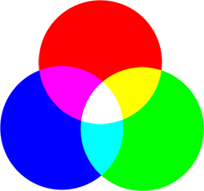

Không gian màu (Colour Space) được hiểu là các mô hình toán để miêu tả màu sắc. Mỗi không gian màu đều có một tác dụng và ứng dụng trong các bài toán khác nhau. Trong bài viết này sẽ trình bày một cách cơ bản về các hệ màu và cách thức chuyển đổi giữa các hệ màu khác nhau.

## Mục lục 
* [Các hệ màu cơ bản](#colourspace)  
    * [Hệ màu RGB](#rgb)  
    * [Hệ màu HSV](#hsv)
    * [Ảnh xám và ảnh nhị phân](#gray_bianry)
* [Kết luận](#summary)
* [Reference](#refer)

<a name="colourspace"></a>
## Các hệ màu cơ bản
<a name="rgb"></a>
### Hệ màu RGB



RGB là không gian màu phổ biến dùng trong máy tính, máy ảnh, điện thoại và nhiều thiết bị kĩ thuật số khác nhau. Không gian màu này khá gần với cách mắt người tổng hợp màu sắc. Nguyên lý cơ bản là sử dụng 3 màu sắc cơ bản R (red - đỏ), G (green - xanh lục) và B (blue - xanh lam) để biểu diễn tất cả các màu sắc.

Thông thường, trong mô hình 24 bit mỗi kênh màu sẽ sử dụng 8bit để biểu diễn, tức là giá trị R, G, B nằm trong khoảng 0 - 255. Bộ 3 số này biểu diễn cho từng điểm ảnh, mỗi số biểu diễn cho cường độ của một màu. Với mô hình màu 24bit thì số màu tối đa có thể tạo ra là *255 x 255 x 255 = 16581375* màu. Một điểm cân lưu ý là với các thư viện đọc ảnh và hiển thị ảnh như matplotlib, Pillow thì các ảnh được đọc theo RGB tuy nhiên **Opencv đọc ảnh theo các kênh BGR**. 

Bên cạnh hệ màu RGB thì ta sẽ nghe đến RGBA, thực ra đây là một hệ màu được lấy căn bản từ hệ màu RGB tuy nhiên có thêm một kênh alpha ($\alpha$). Kênh $\alpha$ được sử dụng như là kênh mờ, nếu một pixel có giá trị 0% trong kênh $\alpha$ của nó thì nó hoàn toàn trong suốt, trong khi giá trị 100% sẽ khiến cho điểm đó bị mờ đục. Điều này được ứng dung rất nhiều trong việc ghép các ảnh lại và mang một độ chân thực nhất định

<a name="hsv"></a>
### Hệ màu HSV 
Không gian màu HSV (còn gọi là HSB) là một cách tự nhiên hơn để mô tả màu sắc, dựa trên 3 số liệu:

- H: (Hue) Vùng màu
- S: (Saturation) Độ bão hòa màu
- B (hay V): (Bright hay Value) Độ sáng

Ứng dụng điển hình nhất của HSV là trong việc lọc màu. Giả sử chúng ta có 1 bài toán là nhận dạng màu sắc của đèn đường giao thông và đầu vào là ảnh dưới và yêu cầu ở đây là nhận dạng đèn màu xanh lá cây. 


Với bài toán này thì hướng tiếp cận đơn giản nhất chính là lọc màu xanh lá cây ra khỏi ảnh. Từ kiến thức ở bên trên thì mỗi một màu sẽ được thể hiện tương đối qua một khoảng giá trị với mỗi hệ màu tương ứng. Vậy chúng ta sẽ làm một phép thử qua 2 hệ màu RGB và HSV xem hiệu quả như thế nào 

Trước hết chúng ta gọi một vài thư viện cần thiết 

```python
import os
import cv2              #thư viện opencv-python
import numpy as np      # thư viện numpy cho xử lý mảng
```
Với hệ màu RGB:
```python
imgpath = 'traffic_light.jpeg'
# Đọc ảnh 
img = cv2.imread(imgpath)
# Với [0,255,0] là màu xanh trong Opencv vậy thì ta sẽ chọn khoảng cho màu xanh với kênh G từ 220 -> 255, còn với hai kênh R,B thì sẽ khoảng từ 0 -> 50
lower_green = np.array([0, 220, 0]) 
upper_green = np.array([50, 255, 50]) 

# Hàm cv2 inRange sẽ trả về mảng trong đó với những pixel trong khoảng màu ở trên thì giá trị là 255 còn lại sẽ bằng 0
mask = cv2.inRange(img, lower_green, upper_green) 

# Sử dụng hàm logic and để hiển thị kết quả
result = cv2.bitwise_and(img, img, mask = mask) 
```
Và đây là kết quả :


Kết quả có vẻ không được tốt :D nhưng cũng có thể là do việc chọn khoảng khá cao với kênh G (220) khiến không nhận được màu. Tiếp tục thay khoảng rộng thêm 1 chút nữa

```python
lower_green = np.array([0, 200, 0]) 
upper_green = np.array([70, 255, 70]) 
```
Kết quả nhận lại vẫn là một màu đen, có vẻ hệ màu RGB hoạt động không được tốt lắm. Tiếp theo chúng ta có thể thử với hệ màu HSV

```python
imgpath = 'traffic_light.jpeg'
# Đọc ảnh 
img = cv2.imread(imgpath)
hsv = cv2.cvtColor(img, cv2.COLOR_BGR2HSV)

#chọn ngưỡng cho hệ màu HSV
lower_blue = np.array([36,0,0]) 
upper_blue = np.array([86,200, 200]) 

mask = cv2.inRange(img, lower_green, upper_green) 

# Sử dụng hàm logic and để hiển thị kết quả
result = cv2.bitwise_and(img, img, mask = mask) 
```
Và đây là kết quả khi sử dụng hệ màu hsv


Từ 2 kết quả trên măc dù với các ngưỡng tương đối nhưng có thể nhận xét được hệ màu HSV hoạt động khá là tốt trong các bài toán cần lọc màu hay tiến xa hơn là việc nhận dạng, tracking v..v. 

Thức tế với các bài toán khi có ảnh rõ ràng thì hoàn toàn có thể sử dụng hệ màu RGB tuy nhiên trong điều kiện thực tế thường các màu sẽ bị mờ hoặc có vẩn đục do ngoại cảnh bên ngoài nên thường hay ưu tiên việc sử dụng hệ màu HSV hơn 

<a name="gray_bianry"></a>
### Ảnh xám và ảnh nhị phân
Ảnh xám (GrayScale) đơn giản là một hình ảnh trong đó các màu là các sắc thái của màu xám. Lý do cần phải phân biệt giữa ảnh xám và các ảnh khác nằm ở việc ảnh xám cung cấp ít thông tin hơn cho mỗi pixel. Với ảnh thông thường thì mỗi pixel thường được cung cấp 3 trường thông tin trong khi với ảnh xám chỉ có 1 trường thông tin, việc giảm khối lượng thông tin giúp tăng tốc độ xử lý nhưng vẫn đảm bảo các tác vụ cần thiết

Ảnh nhị phân (binary) được xem như là 1 bước giảm thông tin nữa so với ảnh xám. Với ảnh xám thì ngưỡng xám của mỗi pixel được miêu tả trong khoảng [0;255] nhưng với ảnh nhị phân thì mỗi pixel chỉ có giá trị bằng 0 hoặc 255. Tuy thông tin bị giảm khá nhiều nhưng ảnh nhị phân lại thể hiện được rất rõ các yếu tố về góc cạnh và hình dàng của vật thể, điều đó rất có lợi trong các bài toán lọc nhiễu, nhận dạng vật thể (object detection), v..v

<a name="summary"></a>
## Kết luận

Bài viết này tổng hợp và khái quát sơ bộ một số hệ màu cơ bản được dùng nhiều trong xử lý ảnh và ứng dụng trong các trường hợp thực tế. Mong bài viết sẽ có ích cho mọi người :D

<a name="refer"></a>
## Reference

[Code](https://github.com/buiduchanh/Opencv_tutorial/tree/master/Colour_space)

[Why we should you HSV in image processing](https://dsp.stackexchange.com/questions/2687/why-do-we-use-the-hsv-colour-space-so-often-in-vision-and-image-processing)

