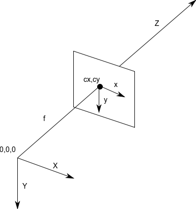

Trong [bài viết](https://buiduchanh.github.io/Colour-space/) trước chúng ta đã hiểu sơ qua về các hệ màu cơ bản dùng trong xử lý ảnh. Ở bài viết này chúng ta sẽ tiếp tục tìm hiểu một số hàm xử lý thông dụng trong Opencv

* [Các hàm xử lý ảnh trong Opencv](#coreoperation) 
    * [Hệ quy chiếu của ảnh trong Opencv](#system_operation)
    * [Các hàm xử lý cơ bản](#basicoperation)  
    * [Các phép toán trên ảnh](#math)    
    * [Các phép đo](#caculation)
* [Kết luận](#summary)
* [Tham khảo](#refer)

<a name="coreoperation"></a>
## Các hàm xử lý ảnh trong Opencv
<a name="system_operation"></a>
### Hệ quy chiếu của ảnh trong Opencv



Ảnh trong Opencv thông thường được biển diễn dưới dạng ma trận số, giá trị trả về là một mảng nhiều chiều với các thông số : chiều cao, chiều rộng, số chiều ( với ảnh RGB thì là 3 ứng với 3 kênh màu). Trong đó pixel ở diểm trên cùng góc trái được quy định là gốc tọa độ mang giá trị x =0, y=0. Giá trị của x tăng từ trái sang phải trong khoảng [0;imgWidth], giá trị y tăng từ trên xuống dưới trong khoảng [0;imgHeight]. 

Trong một số trường hợp cần mô tả một đối tượng dạng 3D thì ngoài 2 chiều x,y thì sẽ thêm chiều z, điều này cho phép vị trí mỗi điểm trong hệ tọa độ được miêu tả là (x,y,z). Trong Opencv thì kích thước chiều z tăng dần theo hướng xa mắt người xem. Điều này khiến Opencv thành một hệ toạ độ thuận tay phải ( x tăng theo hướng phải, y tăng về hướng xuống dưới, z tăng theo hướng mắt người xem)  

<a name="basicoperation"></a>
### Các hàm xử lý cơ bản

*1. Chỉnh sửa giá trị của các pixel*

```python
import os
import cv2

image_path = ''
img = cv2.imread(image_path)   # Đọc ảnh và trả về một ma trận 3 chiều ứng với các kênh màu B,G,R
px = img[100,100]              # Kiểm tra giá trị pixel với tọa độ (100,100)
print(px)                      
# [157 166 200]
img[100,100] = [255,255,255]   # Chỉnh sửa giá trị của pixel
print (img[100,100])
#[255 255 255]
```

```python
img.item(50,50,2)              # Kiểm tra giá trị kênh màu Green của pixel tại tọa độ (50,50)
print(img.item(50,50,2))

img.itemset((50,50,2),100)     # Chỉnh sửa giá trị kênh Green của pixel
img.item(50,50,2)
print(img.item(50,50,2))

```
*2. Kiểm tra các thuộc tính của ảnh*

- Kích cỡ của ảnh : ta có thể sử dụng *img.shape*. Hàm shape sẽ trả về một mảng 3 chiều bao gồm chiều cao, chiều rộng và số kênh màu.  
- Tổng số pixel : ta có thể sử dụng *img.size*  
- Datatype của ảnh : ta có thể sử dụng *img.dtype*  

```python
print(img.shape)

print(img.size)

print(img.dtype)

```

*3. Tách và ghép các kênh màu*

Với Opencv thì ngoài việc xử lý trên cả ảnh thì có thể tách riêng các kênh màu để xử lý sau đó có thể ghép các kênh đó lại với nhau. 

```python
b,g,r = cv2.split(img)      # Tách ảnh màu thành các kênh màu B,G,R
img = cv2.merge((b,g,r))    # Ghép các kênh màu lại với nhau 
```
<a name="math"></a>
### Các phép toán trên ảnh


