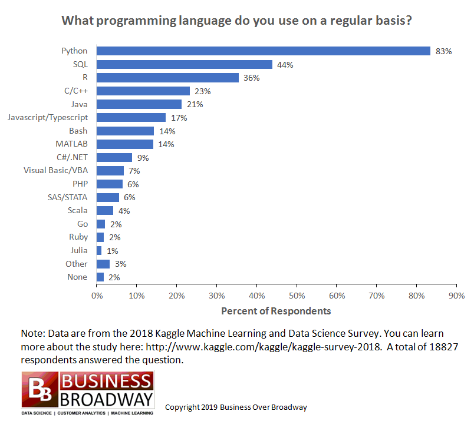

## Tôi là ai mà tại sao tôi lại ở đây ?

Vì các bài viết của mình sẽ tiếp cận với nhiều lứa tuổi khác nhau nên trong các bài viêt mình xin phép được gọi mọi người là bạn và được xưng là tôi hoặc mình. Mình là Hạnh, mình là cựu sinh viên khoa Tự Động Hóa của trường đại học Bách Khoa Hà Nội. Mình tập quen với những kiến thức đầu tiên của AI từ những ngày là sinh viên năm 2 đại học, đến năm thứ 4 thì mình đã “trót lọt” phỏng vấn và làm việc trong một công ty Nhật Bản chuyên về AI ( Computer Vision). Sau một thời gian làm việc thì là sự nổi lên của những từ như “AI”, “4.0” ở Việt Nam kéo theo sự mong muốn tìm hiểu của rất nhiều người. Vì vậy mình viết những bài viết này với mong muốn chia sẻ cho mọi người những điều liên quan đến mảng AI nói chung và Computer vision nói riêng nhưng chủ yếu tập trung vào 3 vấn đề chính :
- Thông tin về ngành AI trong nước, ngoài nước
- Kiến thức từ cơ bản đến nâng cao mảng Computer vision
- Một số kinh nghiệm từ cá nhân

## Trước khi học về AI thì cần gì ?**

Trước khi đọc phần tiếp theo thì theo ý kiến cá nhân mình nghĩ trước khi các bạn đặt câu hỏi nên học gì để có thể làm việc trong ngành AI thì nên trả lời 2 câu hỏi :

> AI là gì ? Làm AI là làm về cái gì ?

AI là một ngành rất rộng , nhiều chuyên ngành khác nhau và cũng có những ứng dụng khác nhau trong cuộc sống. Chính vì lí do đó nếu mọi người không có một mục tiêu, định hướng rõ ràng thì khi học rất dễ rơi vào một bể kiến thức mà không biết nên bắt đầu từ đâu và nên làm gì. Cũng như trong mục tiêu ban đầu của mình thì series bài viết này cũng như các bài về sau mình sẽ chỉ tập trung chính vào mảng CV ( Computer vision) — một mảng được cho là ứng dụng rộng rãi nhất hiện nay

## Lộ trình học AI cơ bản

Sau khi đã trả lời được hai câu hỏi phía trên thì mình nghĩ các bạn đã có một hình dung một cách cơ bản chung chung về khái niệm AI. Vậy câu hỏi tiếp theo là nên làm gì, học gì để trở thành một kĩ sư AI. Phần này mình lại nhấn mạnh điều này “tất cả các chia sẻ ở đây đều được trích xuất từ kinh nghiệm cá nhân nên nó chỉ mang tính tham khảo” :D

### 1. Toán

Phần này chắc được đánh giá là chán ngán nhất trong các phần vì động vào nỗi đau của kha khá các bạn từ tuổi “thanh niên” đến tuổi “thâm niên” :D. Tuy nhiên mình muốn nhấn mạnh nếu mọi người muốn theo học ngành này thì việc bổ sung thêm kiến thức về toán là không thể tránh khỏi vì bản chất của AI là xác suất thống kê ( nói rộng ra là toán ). Học toán ở đây không phải là mọi người mua quyển sách toán cao cấp và hoc từng chương mà mình nên bổ sung các kiến thức về Ma trận, vectơ, xác suất qua từng bài học về ML. Ví dụ như khi học về Gradient descent thì sẽ cực tiểu hóa hàm “loss” -> lúc đấy mình sẽ lần lại kiến thức về đạo hàm v..v.

### 2. Lập trình (Code)

Cái này thì nó là hiển nhiên rồi :D Với những bạn có nền tảng về lập trình sẵn như các bạn Dev muốn chuyển ngành thì việc này khá là đơn giản do các bạn đã có nền tảng sẵn nên việc học sẽ không mất nhiều thời gian. Ở đây việc lập trình mình chia làm 2 vấn đề chính :

- Lập trình cơ bản
- Các framework của AI/Deep learning

Về phần 1 thì khá đơn giản, với những bạn không biết lập trình là gì thì có thể lên gg search một số bài lập trình cơ bản về Python. Python hiện tại vẫn là ngôn ngữ thông dụng nhất và được hỗ trợ nhiều nhất cho mảng AI/ Deep learning.

Với phần 2, hiện tại thì các công ty, tổ chức lớn như google, facebook đều hỗ trợ những framework rất mạnh về AI như tensorflow, pytorch, v..v. Với việc sử dụng các framework thì mình sẽ cố gắng trình bày rõ ràng trong các series tiếp theo khi vào các dự án thực tế.

### 3. Kiến thức về AI/ML

AI nói chung và Machine learning nói riêng đã được phát triển từ cách đây khá lâu tuy nhiên số lượng các paper mới tăng vọt trong vòng vài năm gần đây. Quay trở lại với phần đầu thì mình xin phép được nhấn mạnh “nếu bạn không có một định hướng cụ thể thì bạn sẽ rơi vào một bể kiến thức khổng lồ mà không biết nên làm gì và bắt đầu từ đâu”. Nếu các bạn chưa trả lời được 2 câu hỏi mình nêu ra ở đầu thì phần này không dành cho các bạn.

Sau khi đã có kiến thức cơ bản một chút về toán và lập trình thì chúng ta sẽ bắt đầu học về ML. Trong series này ngoài những bài cung cấp lý thuyết chung thì sẽ có những bài mình sẽ hướng dẫn mọi người xây dựng một dự án thực tế và ở các phần này chúng ta sẽ xoay quanh các việc chính

- Đặt vấn đề, tìm giải pháp
- Đọc hiểu lý thuyết
- Code thực hiện ( Train, test, eval “nhiều lần” )
- Suy nghĩ, đánh giá về các trường hợp lỗi
- Fix lỗi ( không fix được thì lại quay lại đọc hiểu lý thuyết thôi :D )

Ngoài có rất nhiều khóa học về AI/ML cung cấp những tài liệu và kiến thức cơ bản mà các bạn có thể học như , khóa học của  v..v

Vì những khóa học trên đa phần bằng tiếng anh nên sẽ có những khó khăn nhất định. Tuy nhiên không khó thì không phải là “học” đúng không ^_^.

## Kết luận

Trong bài viết này mình chỉ nêu ra các phần cơ bản cũng như định hướng trong series sắp tới mà mình định viết. Vì công việc cũng khá bận nên mình sẽ cố gắng viết khoảng 1–2 bài/1 tuần. Mình có lập ra một  và  trên facebook để tạo sân chơi cho mọi người chia sẻ thêm những kiến thức, kinh nghiệm về mảng AI nói chung và CV nói riêng.

Vì mình còn khá trẻ nên những bài viết còn khá nhiều thiếu xót, có gì mong mọi người góp ý và chia sẻ thêm. Mình xin cảm ơn.