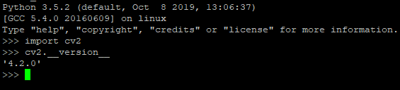

Opencv (Open Computer Vision Library) là một thư viện chuyên biệt dành cho xử lý ảnh. Với các bạn mới bắt đầu thì việc cài đặt nó khá đơn giản có thể thông qua *pip install opencv-python*. Với việc cài đặt như vậy thì đa phần đã sử dụng được gần hết các thư viện của Opencv, tuy nhiên việc cài đặt bằng pip có khá nhiều hạn chế sau này tiêu biểu là 2 vấn đề lớn sau : 

- Khi cài bằng pip thì ta sẽ không dùng được những thư viện nhúng (có hỗ trợ GPU) sẵn trong Opencv như (Yolo, EAST, Dlib ,v..v)
- Tăng tốc độ một số hàm tính toán khi sử dụng trên GPU  

Vì vậy trong bài viết này mình sẽ hướng dẫn mọi người cách cài đặt Opencv với Cuda và cudnn. Môi trường mình đang sử dụng là Ubuntu16.04LTS, Cuda 10.0, Cudnn 7.5, Python 3.5

## Cài đặt một số thư viện và thiết lập cơ bản 

```console
$ sudo apt update
$ sudo apt upgrade
$ sudo apt install build-essential cmake pkg-config unzip yasm git checkinstall
$ pip install numpy
```

Tiếp theo chúng ta sẽ cài đặt một vài thư viện Video/Audios

```console
$ sudo apt install libjpeg-dev libpng-dev libtiff-dev
$ sudo apt install libavcodec-dev libavformat-dev libswscale-dev libavresample-dev
$ sudo apt install libgstreamer1.0-dev libgstreamer-plugins-base1.0-dev
$ sudo apt install libxvidcore-dev x264 libx264-dev libfaac-dev libmp3lame-dev libtheora-dev 
$ sudo apt install libfaac-dev libmp3lame-dev libvorbis-dev
```

Một số thư viện dành cho việc tối ưu và tùy chọn

```console
$ sudo apt-get install libatlas-base-dev gfortran
$ sudo apt-get install libprotobuf-dev protobuf-compiler
$ sudo apt-get install libgoogle-glog-dev libgflags-dev
$ sudo apt-get install libgphoto2-dev libeigen3-dev libhdf5-dev doxygen
```

## Cài đặt Opencv từ source code

Tiến hành download thư viện opencv và opencv_contribute từ source 

```console
$ cd ~
$ wget -O opencv.zip https://github.com/opencv/opencv/archive/4.2.0.zip
$ wget -O opencv_contrib.zip https://github.com/opencv/opencv_contrib/archive/4.2.0.zip
$ unzip opencv.zip
$ unzip opencv_contrib.zip
```
Tiến hành build thư viện

```console
$ cd opencv-4.2.0
$ mkdir build
$ cd build

$ cmake -D CMAKE_BUILD_TYPE=RELEASE \
-D CMAKE_INSTALL_PREFIX=/usr/local \
-D INSTALL_PYTHON_EXAMPLES=ON \
-D INSTALL_C_EXAMPLES=OFF \
-D WITH_TBB=ON \
-D WITH_CUDA=ON \
-D BUILD_opencv_cudacodec=OFF \
-D ENABLE_FAST_MATH=1 \
-D CUDA_FAST_MATH=1 \
-D WITH_CUBLAS=1 \
-D WITH_V4L=ON \
-D WITH_QT=OFF \
-D WITH_OPENGL=ON \
-D WITH_GSTREAMER=ON \
-D OPENCV_GENERATE_PKGCONFIG=ON \
-D OPENCV_PC_FILE_NAME=opencv.pc \
-D OPENCV_ENABLE_NONFREE=ON \
-D OPENCV_PYTHON3_INSTALL_PATH=~/<virtualenv>/lib/python3.5/site-packages \
-D OPENCV_EXTRA_MODULES_PATH=~/opencv_contrib-4.2.0/modules \
-D PYTHON_EXECUTABLE=~/<virtualenvs>/bin/python \
-D BUILD_EXAMPLES=ON
-D CUDA_ARCH_BIN=7.5
-D BUILD_SHARED_LIBS=OFF ..
```

Ở trên đây có một vài thông số bạn cần quan tâm :
- *WITH_CUDA=ON*                    : Dòng này để sử dụng Cuda khi build lib opencv
- *CUDA_ARCH_BIN=7.5*               : Dòng này là version của Cudnn hiện tại
- *OPENCV_PYTHON3_INSTALL_PATH*    : Ở đây mình đang dùng môi trường ảo virtualenv nên đường dẫn của mình sẽ là đến thư mục $lib/python3.5/site-packages$ của môi trường
- *OPENCV_EXTRA_MODULES_PATH*       : Đường dẫn đến thư mục chứ opencv_contribute
- *PYTHON_EXECUTABLE*               : Tương tự như trên sẽ là đến $bin/python$ trong môi trường ảo

Sau khi hoàn thành lệnh trên các bác có thể tiến hành build thư viện 

```console
$ nproc                 # Xem số core của cpu phục vụ cho việc build
$ make -j8              # j4,j8,j16 tùy vào số core trên máy bạn
$ sudo make install
$ sudo /bin/bash -c 'echo "/usr/local/lib" >> /etc/ld.so.conf.d/opencv.conf'
$ sudo ldconfig
```

:D Thử import kiểm tra kết quả xem 



